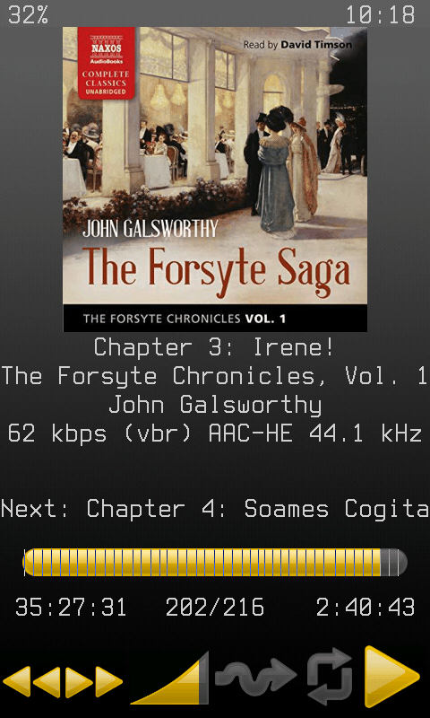
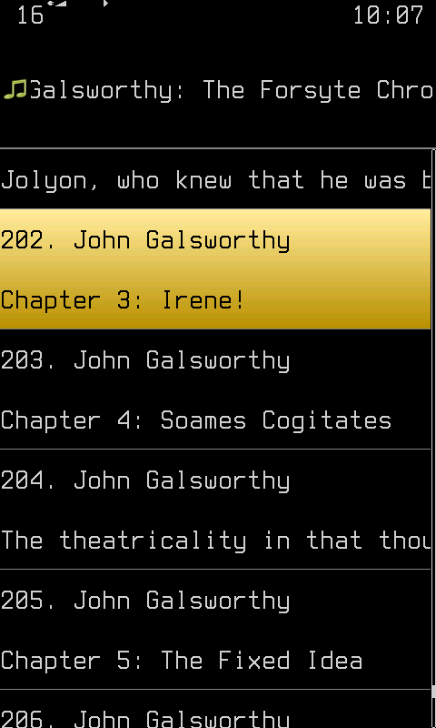

# Rockbox Audiobook Mod

A custom Rockbox build focused on optimizing the audiobook experience and adding dedicated HiBy R1 enhancements.

**Downloads:** [HiBy R1](https://github.com/bahusoid/rockbox/releases) | [Other Devices (Dev Builds)](#development-builds)  
**Docs:** [Audiobooks](https://github.com/bahusoid/rockbox/blob/Mod25.12.07/docs/mods/audiobook-mod.md) | [R1 Button Mapping](https://github.com/bahusoid/rockbox/blob/Mod25.12.07/docs/mods/hibyr1-keymap.md) | [Touch Controls](https://github.com/bahusoid/rockbox/blob/Mod25.12.07/docs/mods/touch-controls.md) | [Bluetooth](https://github.com/bahusoid/rockbox/blob/Mod25.12.07/docs/mods/bluetooth-hiby-x1600.md) | [Key Remapping](https://github.com/bahusoid/rockbox/blob/Mod25.12.07/docs/mods/key-remapping.md)

## Screenshots
<table>
  <tr>
    <td></td>
    <td></td>
  </tr>
</table>

## Core Features & Improvements

*   **[Audiobooks](docs/mods/audiobook-mod.md):** A specialized, smart profile for audiobook listeners:
    *   **Prev/Next** buttons perform 30-second skips (standard track skipping remains for music).
    *   Folder bookmarks are created exclusively for audiobooks.
    *   Playback speed automatically resets to normal when switching back to music.
    *   Added M4B chapters support (via CUE generation directly within Rockbox).
*   **Media & Album Art:**
    *   **PictureFlow:** Supports reading embedded album art.
    *   **ImageViewer:** Uses the system JPEG decoder to efficiently load large JPEG images without preloading them into memory. Implements smart resize for frameless viewing and displays embedded album art from Ogg/Opus files.
*   **Other Updates:** A wide array of other under-the-hood fixes and improvements. See the [full list of changes](https://github.com/Rockbox/rockbox/compare/master...bahusoid:rockbox:Mod25.12.07).

Available in the latest release:
* **Bookmark Filtering:** Filter existing bookmarks by the currently playing track (open the context menu in the Bookmarks list and select "Filter by Playing Track"). Useful when you have many bookmarks for different files in the same directory.
* **Screen-Off Shutdown Beep:** Added an audible beep when powering off via the hardware button, preventing over-pressing in your pocket.
  *Plot twist:* Voice Menu must be disabled to hear this. It's on by default but silent without a voice file installed for accessibility reasons. Disable it in *Settings -> General Settings -> Voice -> Voice Menu*.
* **Tweaked Default Settings:** See the [full list of changes](https://github.com/bahusoid/rockbox/blob/Mod25.12.07/docs/mods/changed_defaults.md).
* **New Codecs:**
    * DSD256 support: `.dsf`, `.dff`, and SACD `.iso` playback. Thanks to **Black0ut111** and his [mod for FiiO M3K](https://github.com/Black0ut111/Hi-M3k-Rockbox) for [patch enabling DSD64 playback](https://github.com/Black0ut111/Hi-M3k-Rockbox/blob/main/patches/0041-dsd64-dsf-dff-playback.patch) (with my small addition removing the DSD64 limit).
    * WIP `.m4a` DASH initial support (currently works only for AAC LC).
---

## HiBy-Specific Enhancements

*These features are specifically designed and mapped for HiBy R1 and x1600 hardware.*

*   **[HiBy R1 Touchless Navigation](docs/mods/hibyr1-keymap.md):** A custom keymap that enables full Rockbox navigation without needing the touchscreen, including a dedicated **Prev/Rewind** button.
*   **[Bluetooth Integration](docs/mods/bluetooth-hiby-x1600.md):** Built upon bidhata's [HiBy R1 patches](https://github.com/bidhata/hiby-r1-rockbox-bt) with major features and stability improvements:
    *   Reliable connection and discovery handling by replacing the glitchy proprietary HiBy `sys_server` with `bluetoothctl`
    *   Added support for Bluetooth headset media buttons.
    *   Added direct Bluetooth management in the Status menu (enable/disable, codec switching, reconnection).
*   **Additional Community Patches** *(Note: Most of these are now integrated into the official Rockbox release and are retained here primarily for functional reference)*:
    *   USB DAC (found in Settings > General Settings > System > USB > USB DAC) by [@michaelmcallister](https://gerrit.rockbox.org/r/c/rockbox/+/7674)
    *   Touchscreen Keyboard by [@michaelmcallister](https://gerrit.rockbox.org/r/c/rockbox/+/7695)
    *   [Gestures, swipes, and kinetic scrolling](docs/mods/touch-controls.md) by @amachronic

Available in the latest release:

* **Extended runtime:** Reduced power consumption by optimizing frequent background checks.
* **Battery Protection Options:** Added configurable limits for charging voltage, current, and low-battery power-off (*Settings -> General Settings -> System -> Limits*).
  *Shortcut:* Long-press 'System' in the Main Menu to open System Settings directly.
* **Touchscreen Exemptions:** Added the ability to disable touch controls in WPS and/or Lists/Menus (*Settings -> General Settings -> Display -> Touchscreen Settings -> Touchscreen Exemptions*).
* **Snappier Scrolling & Navigation:** Removed scrolling inertia when stopping. Disabled the right-half screen tap for the **Quickscreen** to prevent accidental activations when attempting to navigate **Back**.
* **Touch-Friendly Lists:** Increased the default size of list elements. Fine tune it for your fingers via *Settings -> General Settings -> Display -> Touchscreen Settings -> Line Padding in Lists*.
* **UI Enhancements:** Larger system font and various default theme tweaks.
* **Key Remapping:** Made keymap remap friendly. Added documentation and ready-to-use examples. See [Key Remapping](docs/mods/keyremap.md).
* **Bootloader:** Support for custom firmwares (requires my [modified patcher](https://github.com/bahusoid/rockbox/blob/Mod25.12.07/tools/r1_patcher/r1_patcher.sh)).

---

## Development Builds

The latest development builds are available from the [GitHub Actions workflow](https://github.com/bahusoid/rockbox/actions/workflows/build.yml?query=branch%3AMod25.12.07). Select the most recent successful run and download the build from the "Artifacts" section (at the bottom of the page). Note that the artifact is double-zipped.

For Hiby R1: These builds do not include extra resources (like fonts). For the best experience, install a [full release](https://github.com/bahusoid/rockbox/releases) first, then update with a development build.

---

## Upstream Contributions

Just bragging. Features I've contributed to the official Rockbox repository:

*   **Audiobook Enhancements:**
    *   [M4B support](https://gerrit.rockbox.org/r/q/status:merged+Improve+support+for+long+files+owner:bahusoid): Optimized the code to enable Rockbox to open audiobook files longer than a few hours.
    *   [Rewind](https://gerrit.rockbox.org/r/c/rockbox/+/4760) and [skip length](https://gerrit.rockbox.org/r/c/rockbox/+/5196) functionality that works across tracks.

*   **Format & Codec Support:**
    *   [Embedded album art support](https://gerrit.rockbox.org/r/c/rockbox/+/6329) for Ogg and Opus files.
    *   [Progressive JPEG support](https://gerrit.rockbox.org/r/c/rockbox/+/5961) in the ImageViewer.
    *   Various [M4A/AAC playback fixes](https://gerrit.rockbox.org/r/q/owner:bahusoid+status:merged+%22Codecs:+mp4%22).

*   [And many more...](https://github.com/Rockbox/rockbox/commits?author=bahusoid)
